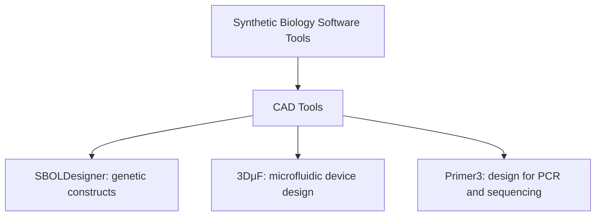
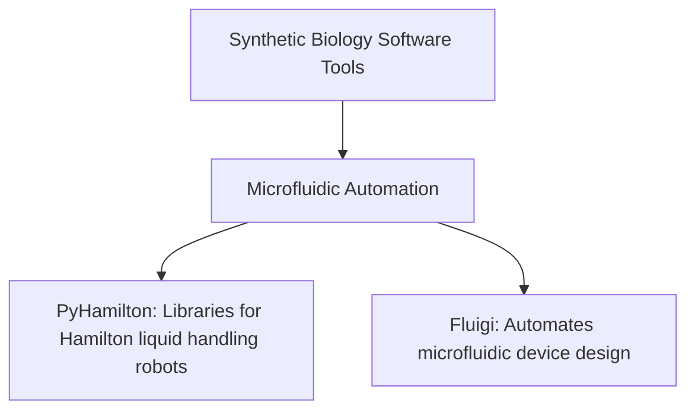
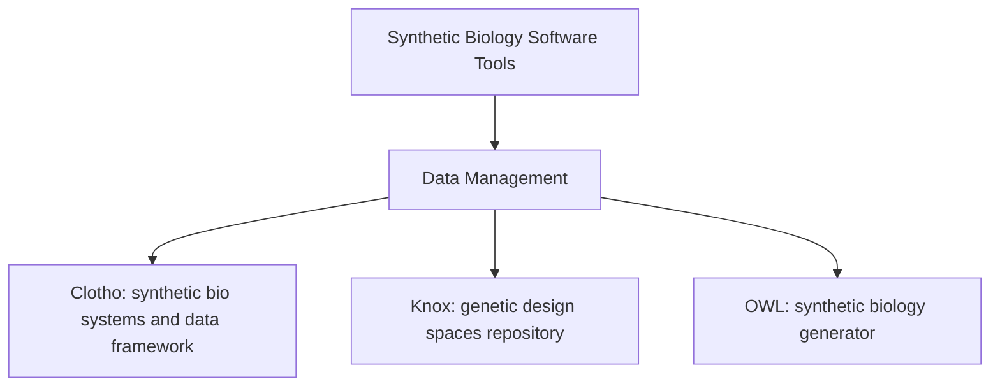
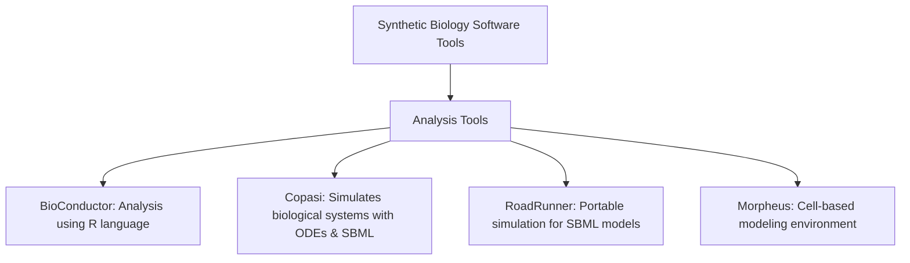
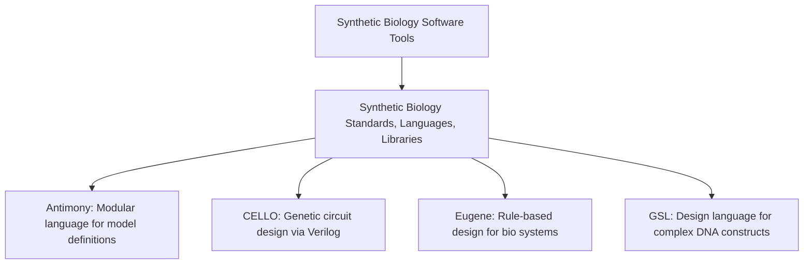

## list of software tools

### CAD Tools

#### SBOLDesigner
A biologist-friendly computer-aided design (CAD) software tool for creating and manipulating genetic constructs using the SBOL 2.2 data model.
- **TAG:** `#SyntheticBiology`, `#GeneticDesign`, `#CAD`, `#Biotech`

#### 3DμF
A visual CAD tool for designing microfluidic devices with outputs in STL, SVG, and JSON formats.
- **TAG:** `#Microfluidics`, `#CAD`, `#DeviceDesign`, `#Biotech`

#### Primer3
Tool for designing and analyzing primers for PCR reactions, sequencing reactions, and hybridization probes.
- **TAG:** `#PCR`, `#PrimerDesign`, `#Bioinformatics`

### Microfluidic Automation

#### PyHamilton
A library for standardized operations with Hamilton liquid handling robots.
- **TAG:** `#Automation`, `#LiquidHandling`, `#Robotics`, `#LabAutomation`

#### Fluigi
Automates the design of microfluidic devices using the MINT language.
- **TAG:** `#Microfluidics`, `#Automation`, `#DeviceDesign`

### Data Management

#### Clotho
Framework for engineering synthetic biological systems and managing the associated data, supporting schema authoring and function execution.
- **TAG:** `#DataManagement`, `#SyntheticBiology`, `#Bioinformatics`

#### Knox
Web-enabled repository for storing, modifying, and tracking genetic design spaces as directed graphs.
- **TAG:** `#DataManagement`, `#GeneticDesign`, `#Bioinformatics`

#### OWL
Datasheet generator for synthetic biology, facilitating efficient datasheet creation and management.
- **TAG:** `#DataManagement`, `#SyntheticBiology`, `#Documentation`

### Analysis Tools

#### BioConductor
Analysis and comprehension tool using the open-source statistical language, R.
- **TAG:** `#DataAnalysis`, `#Bioinformatics`, `#RLanguage`

#### Copasi
Simulates biological systems using ODEs and the Gillespie stochastic simulation algorithm, supporting SBML models.
- **TAG:** `#Simulation`, `#SBML`, `#BiologicalSystems`

#### RoadRunner
Portable simulation engine for systems and synthetic biology models in SBML format.
- **TAG:** `#Simulation`, `#SBML`, `#SyntheticBiology`

#### Morpheus
Modeling environment for simulating cell-based models with ordinary differential equations and reaction–diffusion systems.
- **TAG:** `#Modeling`, `#CellBasedModels`, `#Simulation`

### Synthetic Biology Standards, Languages, Libraries

#### Antimony
A modular human-readable/writable model definition language with easy translation into SBML.
- **TAG:** `#ModelDefinition`, `#SBML`, `#SyntheticBiology`

#### CELLO
Software for creating genetic circuits based on high-level logic specifications in Verilog.
- **TAG:** `#GeneticCircuits`, `#CAD`, `#SyntheticBiology`

#### Eugene
Language ecosystem for rule-based design of synthetic biological systems, devices, parts, and DNA sequences.
- **TAG:** `#RuleBasedDesign`, `#SyntheticBiology`

#### GSL
Language for designing complex DNA constructs used to engineer genomes.
- **TAG:** `#GeneticDesign`, `#SyntheticBiology`

