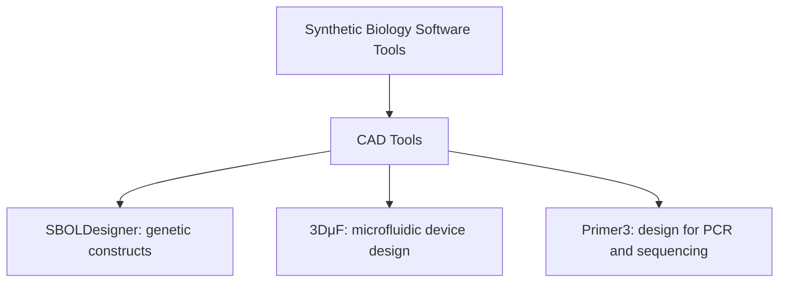
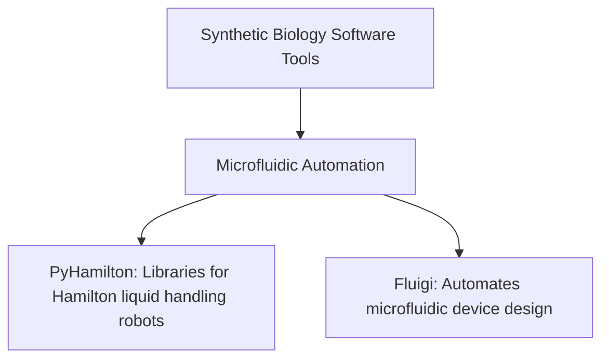
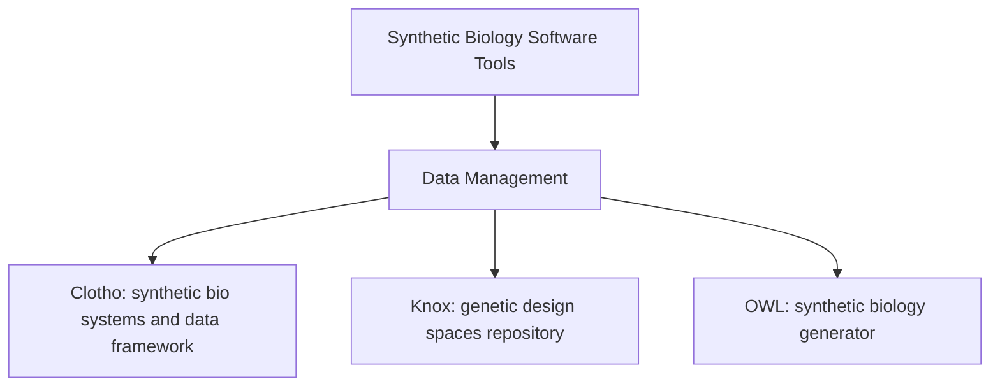
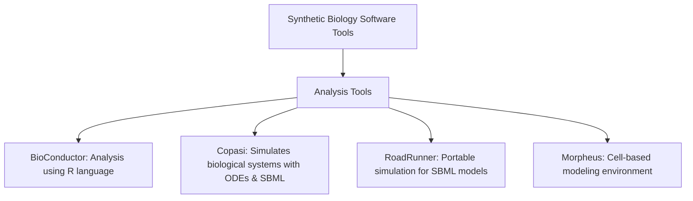
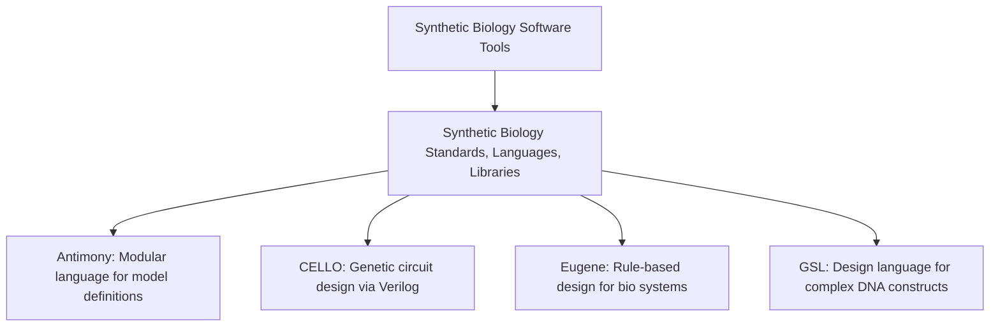

## [biosoc.org](http://biosoc.org) [&#x270D;](https://github.com/biosoc-org/www/edit/main/DOCS/HEAD.md)

BioSoc Society hopes to empower all community members to be makers and creators rather than passive recipients. 
Everyone is encouraged to contribute, no matter what skill level.
We support over a dozen applications in the synthetic biology community and many on Github.
Contributions require testing, bug reports, user documentation, and code examples.

+ [Sources](#Sources)

## BioSoc Software [&#x270D;](https://github.com/biosoc-org/www/edit/main/DOCS/MENU.md)

+ [Design tools](design)
+ [Software for Microfluidic and Biological Automation](assembly)
+ [Data Management](dataops)
+ [Analysis tools](analysis)
+ [Standards, languages, libraries](tools)

 [&#x270D;](https://github.com/biosoc-org/www/edit/main/DOCS/INTRO.md)
## List

### CAD Tools

#### SBOLDesigner
A biologist-friendly computer-aided design (CAD) software tool for creating and manipulating genetic constructs using the SBOL 2.2 data model.
- **TAG:** `#SyntheticBiology`, `#GeneticDesign`, `#CAD`, `#Biotech`

#### 3DμF
A visual CAD tool for designing microfluidic devices with outputs in STL, SVG, and JSON formats.
- **TAG:** `#Microfluidics`, `#CAD`, `#DeviceDesign`, `#Biotech`

#### Primer3
Tool for designing and analyzing primers for PCR reactions, sequencing reactions, and hybridization probes.
- **TAG:** `#PCR`, `#PrimerDesign`, `#Bioinformatics`

### Microfluidic Automation

#### PyHamilton
A library for standardized operations with Hamilton liquid handling robots.
- **TAG:** `#Automation`, `#LiquidHandling`, `#Robotics`, `#LabAutomation`

#### Fluigi
Automates the design of microfluidic devices using the MINT language.
- **TAG:** `#Microfluidics`, `#Automation`, `#DeviceDesign`

### Data Management

#### Clotho
Framework for engineering synthetic biological systems and managing the associated data, supporting schema authoring and function execution.
- **TAG:** `#DataManagement`, `#SyntheticBiology`, `#Bioinformatics`

#### Knox
Web-enabled repository for storing, modifying, and tracking genetic design spaces as directed graphs.
- **TAG:** `#DataManagement`, `#GeneticDesign`, `#Bioinformatics`

#### OWL
Datasheet generator for synthetic biology, facilitating efficient datasheet creation and management.
- **TAG:** `#DataManagement`, `#SyntheticBiology`, `#Documentation`

### Analysis Tools

#### BioConductor
Analysis and comprehension tool using the open-source statistical language, R.
- **TAG:** `#DataAnalysis`, `#Bioinformatics`, `#RLanguage`

#### Copasi
Simulates biological systems using ODEs and the Gillespie stochastic simulation algorithm, supporting SBML models.
- **TAG:** `#Simulation`, `#SBML`, `#BiologicalSystems`

#### RoadRunner
Portable simulation engine for systems and synthetic biology models in SBML format.
- **TAG:** `#Simulation`, `#SBML`, `#SyntheticBiology`

#### Morpheus
Modeling environment for simulating cell-based models with ordinary differential equations and reaction–diffusion systems.
- **TAG:** `#Modeling`, `#CellBasedModels`, `#Simulation`

### Synthetic Biology Standards, Languages, Libraries

#### Antimony
A modular human-readable/writable model definition language with easy translation into SBML.
- **TAG:** `#ModelDefinition`, `#SBML`, `#SyntheticBiology`

#### CELLO
Software for creating genetic circuits based on high-level logic specifications in Verilog.
- **TAG:** `#GeneticCircuits`, `#CAD`, `#SyntheticBiology`

#### Eugene
Language ecosystem for rule-based design of synthetic biological systems, devices, parts, and DNA sequences.
- **TAG:** `#RuleBasedDesign`, `#SyntheticBiology`

#### GSL
Language for designing complex DNA constructs used to engineer genomes.
- **TAG:** `#GeneticDesign`, `#SyntheticBiology`

## Design tools [&#x270D;](https://github.com/biosoc-org/www/edit/main/design/README.md)

This README provides a structured overview of various software tools developed by cidarlab.org, genedesign.org, hicsail, salislab, synbiohub.org, and others focusing on those for designing synthetic biology constructs.
Each tool has its specific use cases, features, and resources available for further exploration.

Parses a rich set of operators as defined by GOLDBAR and enumerates genetic designs that satisfy user-defined specifications through mathematically rigorous graphs.

### SBOL Designer
+  Synthetic Biology Open Language

SBOLDesigner is a simple, biologist-friendly CAD software tool for creating and manipulating the sequences of genetic constructs using the Synthetic Biology Open Language (SBOL) 2.2 data model.

[SBOL](https://sbolstandard.org/) is an open standard for the representation of _in silico_ biological designs, and the icons used in this tool are provided by [SBOL Visual](https://sbolstandard.org/visual/glyphs/). 
Design spaces are expressed in SBOL via the `CombinatorialDerivation` extension and can be exported and stored in [Knox](https://github.com/CIDARLAB/knox). This third form of design space representation allows Constellation to be easily integrated in the synthetic biology [community](https://sbolstandard.org/applications/).

#### Key Features

SBOLDesigner is a user-friendly computer-aided design (CAD) software tool specifically designed for biologists.
It allows users to create and manipulate genetic construct sequences using the Synthetic Biology Open Language (SBOL) 2.2 data model. With SBOLDesigner, researchers can efficiently design and analyze genetic constructs for synthetic biology projects.

1. **Biologist-Friendly Interface:** SBOLDesigner is designed with biologists in mind. Its user-friendly interface makes it accessible to researchers who may not have extensive computational or programming experience.

2. **SBOL 2.2 Support:** The software adheres to the Synthetic Biology Open Language (SBOL) 2.2 data model. This standard allows users to represent genetic constructs, parts, and sequences in a consistent and interoperable format.

3. **Construct Design and Manipulation:** SBOLDesigner enables users to create, edit, and manipulate genetic constructs. You can assemble DNA parts, specify their sequences, and organize them into functional units.

4. **Visual Representation:** The tool provides visual representations of genetic constructs, making it easier to understand and communicate complex designs. Graphical views help users visualize the arrangement of parts and their interactions.

5. **Annotations and Metadata:** SBOLDesigner allows users to annotate constructs with additional information, such as functional descriptions, provenance, and experimental data. Metadata enhances the documentation and traceability of designs.

6. **Export Options:** You can export your designs in SBOL format for sharing with other tools or collaborators. This interoperability ensures seamless integration with other software in the synthetic biology workflow.

#### Resources

+ [Project Website](https://async.ece.utah.edu/tools/sboldesigner/)
+ [Demo](https://www.youtube.com/watch?v=z9rWclkisxI&ab_channel=MyersResearchGroupUniversityofUtah)
+ [SBOLDesigner DEMO on youtube](https://www.youtube.com/watch?v=bR1SDt3RAP0)
+ [SBOLDesigner Description by Myers Research Group](https://async.ece.utah.edu/tools/sboldesigner/)

### constellation-js

Library for combinatorially specifying, constraining, and exploring genetic design spaces.

#### Resources
- [Project Website](https://github.com/hicsail/constellation-js)
- [Source Code](https://github.com/hicsail/constellation-js)
- [Demo](https://www.youtube.com/watch?v=nYqvjrBhhGE&ab_channel=CIDARLAB)

### GeneDesign

Web-based synthetic gene designer with various modules for sequence manipulation such as reverse translator and codon juggler.

#### Resources
- [Project Website](https://www.genedesign.org/index)
- [Source Code](https://github.com/GeneDesign/GeneDesign)

### Pigeon

Web-based tool for translating a textual description of a synthetic biology design into an image, allowing for the programmatic generation of design visualizations.

#### Resources
- [Project Website](https://www.cidarlab.org/pigeon)

### Raven

Uses a dynamic programming algorithm to design high-quality DNA assembly plans and produces SBOL-compliant images with human-readable instructions.

#### Resources
- [Project Website](https://www.cidarlab.org/raven)
- [Source Code](https://github.com/CIDARLAB/raven-public)
- [Demo](https://www.youtube.com/watch?v=1FV4TjnttDY&list=PLqdo5Two_cXhUJUZBQHmBhdsrwWrOW9fQ&index=4&ab_channel=CIDARLAB)

### TASBE

Synthetic biology automation software for tasks from high-level specification to part assignment and assembly.

#### Resources
- [Project Website](https://tasbe.github.io/)
- [Source Code](https://github.com/TASBE/TASBEFlowAnalytics)
- [Demo](https://www.youtube.com/watch?v=JKv3_5WGFOo&ab_channel=CIDARLAB)

### DAFD

First microfluidic design automation software that uses machine learning to deliver a user-specified desired performance.

#### Resources
- [Project Website](http://dafdcad.org/)
- [Source Code](https://github.com/CIDARLAB/dafd)

### Mage

Java part of MERLIN for analyzing genetic packages.

#### Resources
- [Source Code](https://github.com/CIDARLAB/javamage)

### Puppeteer

Web-based planning and instruction generation tool for automating DNA assembly tasks, translating protocols into human- and machine-readable instructions.

#### Resources
- [Project Website](https://www.cidarlab.org/puppeteer)

### Sequence Refiner

Sequence alignment tool that refines a multiple sequence alignment by iterative realignment with a predetermined conserved core model of a protein family.

#### Resources
- [Project Website](https://ftp.ncbi.nih.gov/pub/REFINER/data/)

### Vector Editor

Web-based DNA sequence-editing and analysis tool with features like restriction enzyme manager, amino acid translation, and gel digest prediction.

#### Resources
- [Project Website](https://public-registry.jbei.org/vectoreditor/)
- [Source Code](https://github.com/JBEI/vectoreditor)
- [Demo](https://www.youtube.com/watch?v=Od9QbuAlc0s&ab_channel=JointBioenergyInst)

### Double Dutch

Tool for designing combinational libraries of biological systems using response surface methodology.

#### Resources
- [Demo](https://github.com/CIDARLAB/doubledutch)

### Phoenix
Framework for designing complex genetic systems focusing on behavior over time rather than steady-state behavior.

#### Resources
- [Project Website](https://www.cidarlab.org/phoenix)
- [Source Code](https://github.com/cidarlab/gridtli)
- [Demo](https://www.youtube.com/watch?v=A00VEBxIZXc&list=PLqdo5Two_cXgTi4MpqRtotE-UPBU_UwSu&ab_channel=CIDARLAB)

## RBS Calculator
Predicts and controls translation initiation and protein expression, also optimizes synthetic RBS sequences to achieve targeted translation initiation rates.

#### Resources
- [Project Website](https://salislab.net/software/)
- [Demo](https://www.youtube.com/watch?v=yz2HXqOnHKE&ab_channel=GenomeCompiler)

### SynBioHub
Design repository for uploading and sharing DNA and protein designs.

#### Resources
- [Project Website](https://synbiohub.org/)

### iBioSim
Tool for modeling, analysis, and design of genetic circuits, also applicable to other biological and chemical systems.

#### Resources
- [Project Website](https://async.ece.utah.edu/tools/ibiosim/)
- [Source Code](https://github.com/MyersResearchGroup/iBioSim)
- [Demo](https://www.youtube.com/watch?v=YfsUis2cV2A&ab_channel=SyntheticBiologyOpenLanguageSBOL)

##  Analysis Software [&#x270D;](https://github.com/biosoc-org/www/edit/main/analysis/README.md)

various computational biology software tools, including their types, functionalities, and access to their project websites, source codes, and demos.

### Aquarium

Analysis and comprehension tool leveraging the open-source statistical language, R. AMI and Docker images are available.  

#### Resources

- [Project Website](https://www.aquarium.bio/)  
- [Source Code](https://code.bioconductor.org/)

### Copasi

A standalone program supporting SBML standard models, capable of simulating behavior using ODEs or the Gillespie stochastic simulation algorithm. It includes arbitrary discrete events in simulations.  

#### Resources

- [Project Website](http://copasi.org/)  
- [Source Code](https://github.com/copasi/COPASI)  
- [Demo](https://www.youtube.com/watch?v=4pH16ema-Lg&list=PLHUVSEH0UcxhpX3vhdSJmBcmJywy0PI1P&ab_channel=CopasiTutorials)

### Road Runner

A portable simulation engine for systems and synthetic biology models in SBML format. Written in C#, it incorporates C, C++, and Python APIs.  

#### Resources

- [Project Website](https://www.libroadrunner.org/)  
- [Source Code](https://sourceforge.net/projects/libroadrunner/files/)

### BioConductor

Analysis and comprehension tool using the open-source statistical language, R. AMI and Docker images are available.  

#### Resources

- [Project Website](https://www.bioconductor.org/)  
- [Source Code](https://code.bioconductor.org/)

### Morpheus

A modeling environment for simulating cell-based models with ordinary differential equations and reaction–diffusion systems. It supports multiscale biological models defined in biological terms and mathematical expressions.  

#### Resources

- [Project Website](http://morpheus.gitlab.io/)  
- [Source Code](https://gitlab.com/morpheus.lab/morpheus)

### Tinkercell

Incorporates a detailed diagram that can be mapped to models or experimental results, allowing various mathematical analyses to be run on those models.  

#### Resources

- [Project Website](http://www.tinkercell.com/)  
- [Demo](https://www.youtube.com/watch?v=WRpdorLsrK0&ab_channel=DeepakChandran)

### BioPSy

Performs guaranteed parameter set synthesis for ODE biological models expressed in SBML based on desired behavior expressed by time-series data.  

#### Resources

- [Source Code](https://github.com/dreal/biology)

### Pysces

Provides tools for analyzing cellular systems, including a human-readable model description language, a structural, and a bifurcation analysis module. Supports SBML and SED-ML.  

#### Resources

- [Project Website](https://pysces.sourceforge.net/)  
- [Source Code](https://sourceforge.net/projects/primer3/)

### gro

A programming, modeling, specifying, and simulating language for the behavior of cells in growing microcolonies of microorganisms.  

#### Resources

- [Project Website](https://depts.washington.edu/soslab/gro/)  
- [Source Code](https://github.com/klavinslab/gro)

## Software for Microfluidic and Biological Automation [&#x270D;](https://github.com/biosoc-org/www/edit/main/assembly/README.md)

This repository provides a comprehensive list of tools designed to facilitate the design and automation of microfluidic devices and other biological tasks. Each tool comes with a description, relevant links to project websites, source code, and demo videos.
Feel free to explore the links provided for more information and access to each software tool. For any additional inquiries or support, refer to the respective project websites and repositories.

### Contents

1. [3DμF](#3dμf)
2. [PyHamilton](#pyhamilton)
3. [Fluigi](#fluigi)
4. [Primer3](#primer3)

### 3DμF

3DμF is a visual CAD tool for designing microfluidic devices. It offers outputs in STL for CNC milling, SVG for lithography, and also provides a textual JSON representation.

- **Project Website:** [3DμF Website](https://3duf.org/)
- **Source Code:** [GitHub Repository](https://github.com/CIDARLAB/3DuF)
- **Demo Video:** [YouTube Demo](https://www.youtube.com/watch?v=05nU8eQ73U8&ab_channel=CIDARLAB)

### PyHamilton

PyHamilton provides a set of standardized libraries developed for use with Hamilton liquid handling robots.

#### Resources

- **Source Code:** [GitHub Repository](https://github.com/dgretton/pyhamilton)

### Fluigi

Fluigi automates the design of microfluidic devices used in synthetic biology by optimizing their layout based on specifications in the text-based MINT language.

#### Resources

- **Project Website:** [Fluigi Website](http://fluigicad.org/)
- **Source Code:** [GitHub Repository](https://github.com/CIDARLAB/Fluigi-Cloud)
- **Demo Video:** [YouTube Demo](https://www.youtube.com/watch?v=WO4xAA6XlrY&list=PLqdo5Two_cXhm-twPwbpeV4aCSFE85_in&index=11&ab_channel=CIDARLAB)

### Primer3

Primer3 is a tool used for designing and analyzing primers for PCR reactions. It also allows for the selection of primers for sequencing reactions and hybridization probes.

#### Resources

- **Project Website:** [Primer3 Website](https://bioinfo.ut.ee/primer3/)
- **Source Code:** [SourceForge Repository](https://sourceforge.net/projects/primer3/)
- **Demo Video:** [YouTube Demo](https://www.youtube.com/watch?v=v8ehlJbwcEs&ab_channel=BioinformaticswithDr.Mudasir)

## Data Management [&#x270D;](https://github.com/biosoc-org/www/edit/main/dataops/README.md)

Comprehensive tools aimed at improving data management in synthetic biology.
Each application offers specialized functionalities to support and enhance your research endeavors.
For more information and to access the resources, please refer to the links provided. Should you have any questions or require further assistance, do not hesitate to contact us or visit our project repositories.

### Clotho

Clotho is a versatile framework for engineering synthetic biological systems and managing the data associated with their creation. It allows users to author data schemas, execute functions and algorithms, and integrate with pre-existing applications seamlessly.

#### Resources

- [Source Code](https://github.com/CIDARLAB/clotho3crud)
- [Demo](https://www.youtube.com/watch?v=y-bcUSF8FcY&list=PLqdo5Two_cXhUJUZBQHmBhdsrwWrOW9fQ&ab_channel=CIDARLAB)

### Knox

Knox is a web-enabled repository designed for the storage, modification, and tracking of genetic design spaces. It manages thousands of genetic design variants and represents them as directed graphs. Knox can be accessed via domains in the format `<insertname>.knoxcad.org`.

#### Resources

- [Project Website](https://nonasoftware.org/apps/test.knoxcad.org)
- [Source Code](https://github.com/CIDARLAB/knox)

### OWL

OWL is an automatic datasheet generator specifically designed for synthetic biology, facilitating efficient datasheet creation and management.

#### Resources

- [Source Code](https://github.com/CIDARLAB/Owl_v1)

## Synthetic Biology standards, languages, libraries [&#x270D;](https://github.com/biosoc-org/www/edit/main/tools/README.md)

This documentation provides a comprehensive overview of various software tools useful for synthetic biology applications. 
These tools cover a range of purposes including modular model definition, flow cytometry data analysis, genetic circuit creation, metabolic pathway mapping, genomic reprogramming, and DNA sequence generation.

### Contents

1. [Antimony](#antimony)
2. [FloCal](#flocal)
3. [Kera](#kera)
4. [CELLO](#cello)
5. [GLAMM](#glamm)
6. [Merlin](#merlin)
7. [Eugene](#eugene)
8. [GSL](#gsl)
9. [MoSec](#mosec)

### Antimony 
- Text-based modular language

A text-based modular human-readable/writable model definition language with capabilities of easy translation into SMBL.

#### Resources
- **Project Website**: [Antimony Project Website](https://antimony.sourceforge.net/)
- **Source Code**: [Antimony Source Code](https://antimony.sourceforge.net/files.html)

### FloCal 
- Library for flow cytometry data

A library for reading, analyzing, and calibrating flow cytometry data; accepts FCS files as input and is compatible with different calibration particles, fluorescent probes, and cell types.

#### Resources
- **Project Website**: [FloCal Project Website](https://flowcal.readthedocs.io/en/latest/#)
- **Source Code**: [FloCal Source Code](https://github.com/taborlab/FlowCal)

### Kera 
- Object-oriented programming language

An object-oriented programming language for synthetic biology, tempered by the biopart rule library, Samhita.

#### Resources
- **Source Code**: [Kera Source Code](https://sourceforge.net/projects/kera/files/?source=navbar)

### CELLO 
- Genetic circuit design tool

Software for creating genetic circuits, using as input a high-level logic specification written in Verilog.

#### Resources
- **Project Website**: [CELLO Project Website](https://cellocad.org/#/welcome?redirect=%2Fhome)
- **Source Code**: [CELLO Source Code](https://github.com/CIDARLAB/cello)
- **Demo**: [CELLO Demo](https://www.youtube.com/watch?v=SLn_SkL7vkQ&list=PLqdo5Two_cXhQAL72oXgUShcTBJfSSeJn&ab_channel=CIDARLAB)

### GLAMM

- Metabolic pathway mapping

Provides maps for metabolic pathways, biosynthesis of secondary metabolites, and microbial metabolism.

#### Resources
- **Project Website**: [GLAMM Project Website](https://glamm.lbl.gov/)
- **Source Code**: [GLAMM Source Code](https://code.google.com/archive/p/glamm/source/default/source)

### Merlin

- Genomic reprogramming application

A web-based application for genomic reprogramming via a rapid and efficient method known as Multiplex Automated Genome Engineering (MAGE).

#### Resources
- **Project Website**: [Merlin Project Website](https://www.cidarlab.org/merlin)
- **Source Code**: [Merlin Source Code](https://github.com/CIDARLAB/magelet)

### Eugene

- Language for rule-based design

An ecosystem of languages tailored for rule-based design of synthetic biological systems, devices, parts, and DNA sequences.

#### Resources
- **Project Website**: [Eugene Project Website](https://eugenecad.org/index.html)
- **Source Code**: [Eugene Source Code](https://github.com/CIDARLAB/eugene-v2.0)
- **Demo**: [Eugene Demo](https://www.youtube.com/watch?v=xmGiOq_hVPw&list=PLqdo5Two_cXhUJUZBQHmBhdsrwWrOW9fQ&index=5&ab_channel=CIDARLAB)

### GSL

- DNA construct design language

A language that facilitates the design of large and complex DNA constructs used to engineer genomes; incorporates a set of low-level DNA manipulation primitives.

#### Resources
- **Source Code**: [GSL Source Code](https://github.com/Amyris/GslCore)

### MoSec

- DNA sequence generation application

Java application capable of generating DNA sequences, and exporting formats such as FASTA, GenBank, EMBL, and SBOL from SBML and CellML models.

#### Resources
- **Source Code**: [MoSec Source Code](http://ico2s.org/software/mosec.html)

This document provides a brief overview and resource links for synthetic biology tools to aid in various applications. For further information, visit the respective project websites and source code repositories.

## Sources [&#x270D;](https://github.com/biosoc-org/www/edit/main/DOCS/SOURCES.md)

+ download [biosoc-software.pdf](biosoc-software.pdf)

 [&#x270D;](https://github.com/biosoc-org/www/edit/main/DOCS/MERMAID.md)
---

---
+ Modular Documentation made possible by the [FlatEdit](http://www.flatedit.com) project.
