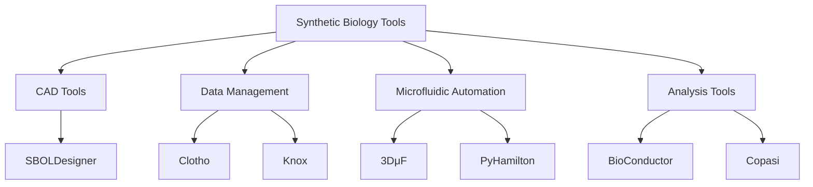
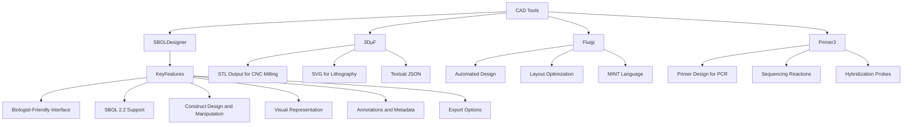
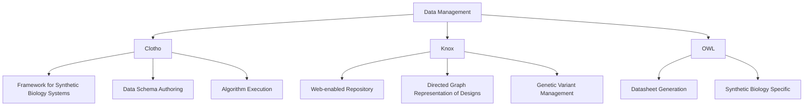
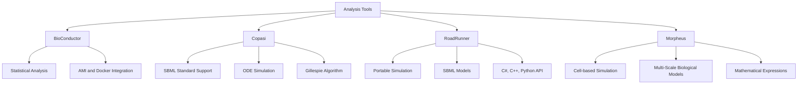

To represent the information you’ve provided efficiently, I’ll break it down into a couple of categories and then show how software tools within these categories are interrelated. Mermaid allows us to create various types of charts including flowcharts, but here the network and hierarchical charts will be most suitable. Let’s start with some examples.

### Example 1: Overview of Synthetic Biology Tools

### Example 2: Detailed CAD Tools Correlation

### Example 3: Data Management Tools Correlation

### Example 4: Analysis Tools Correlation

These diagrams are only a starting point. Each box can be expanded with more granular details and additional layers as necessary, based on the detailed information you may wish to include from your extensive documentation. You can also create separate graphs focusing on specific types of tools like CAD, data management, and analysis tools to provide more detailed insights into each category.
