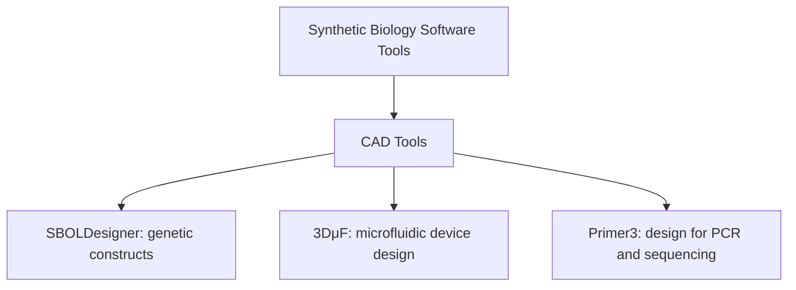
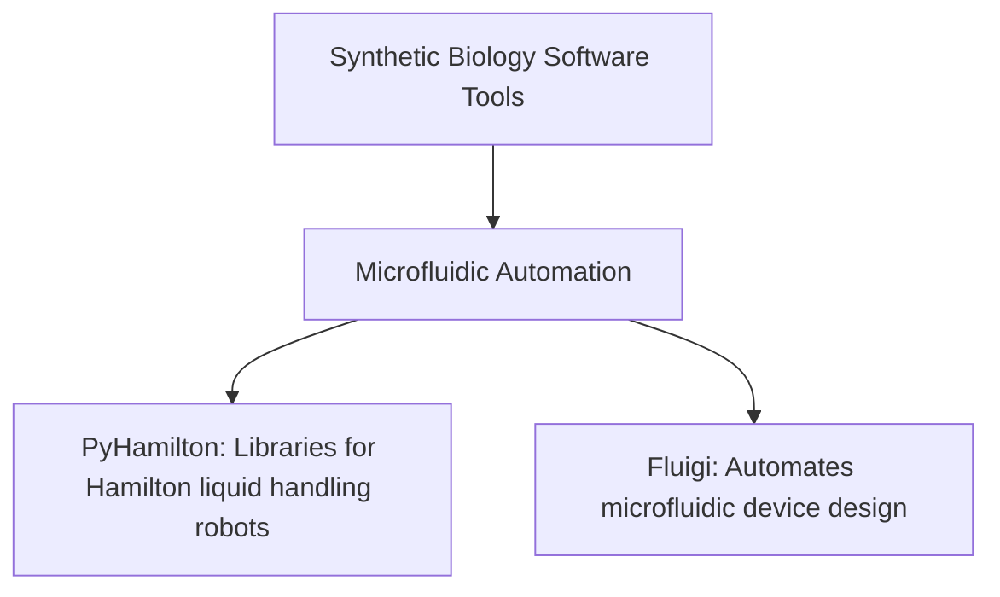
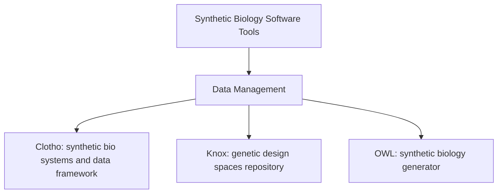
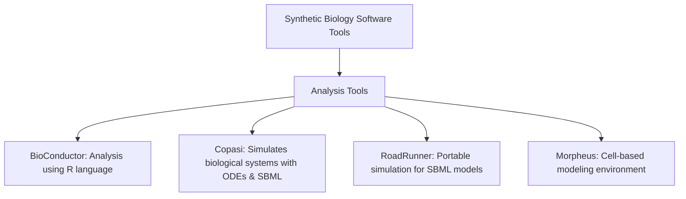
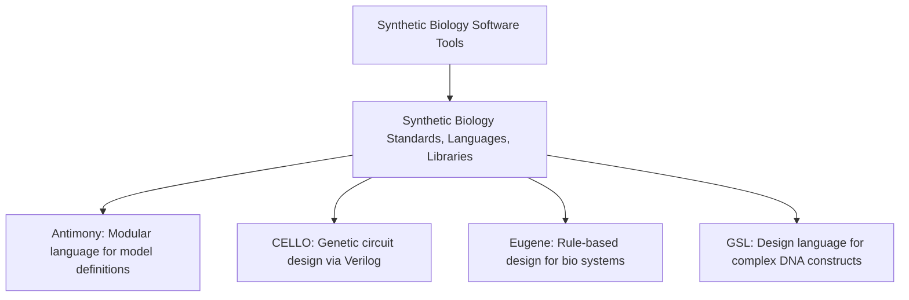

To represent the information you’ve provided efficiently, I’ll break it down into a couple of categories and then show how software tools within these categories are interrelated. Mermaid allows us to create various types of charts including flowcharts, but here the network and hierarchical charts will be most suitable. Let’s start with some examples.

### Example 1: Overview of Synthetic Biology Tools

### Example 2: Detailed CAD Tools Correlation

### Example 3: Data Management Tools Correlation

### Example 4: Analysis Tools Correlation

### Overview of Synthetic Biology Software Tools
This graph provides a clear overview of the categories and their respective software tools.

CAD Tools

Microfluidic Automation

Data Management

Analysis

Synthetic

